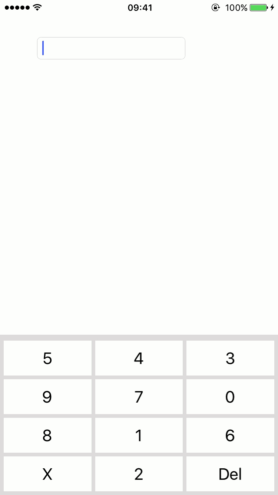

# NORTextField
## 简介
NORTextField 是集成了数字安全键盘的TextField.



## 使用
第一步:拷贝Class文件夹到工程
第二步:在合适的位置#import "NORTextFieldView.h"
第三部:把NORTextFieldView添加到合适的view上

备注: 

* 暂不支持cocoaPods
* 使用了UIView的frame 分类

## 初始化

``` 
/**
 *  懒加载 NORTextField
 */
- (NORTextFieldView *)norTextField
{
    if (_norTextField) {
        return _norTextField;
    }
    
    _norTextField             = [[NORTextFieldView alloc] init];
    _norTextField.frame       = CGRectMake(50, 50, 200, 30); // frame
    _norTextField.delegate    = self; // delegate
    _norTextField.isConfusion = NO; // 是否打乱键盘
    _norTextField.hiddenKeyBoardLeftBottomButton = NO; // 是否隐藏 键盘左下角按钮
    
    return _norTextField;
}
```

## NORTextFieldViewDelegate

应为自己对textField 的inputView 进行了替换, 所以关于输入数据需要自己处理.(键盘的本质作用就是输入数据)

### 开始编辑
```
/**
 * 开始编辑

 * @param textField 编辑的textField
 * @param range 编辑的位置
 * @param string 传入字符串
 * @return 返回是否可以进行编辑
 */
 
- (BOOL)norTextFieldView:(UITextField *)textField shouldChangeCharactersInRange:(NSRange)range replacementString:(NSString *)string;
```

### 结束编辑

```
/**
 * 结束编辑

 * @param textField textField
 **/
 
- (void)norTextFieldViewDidEndEditing:(UITextField *)textField;
```

### 属性

```
/// textFile
@property (nonatomic, strong) UITextField * textField;

/// 是否对键盘进行打乱
@property (nonatomic, assign) BOOL isConfusion;

/// 是否隐藏键盘有右下角按钮
@property (nonatomic, assign) BOOL hiddenKeyBoardLeftBottomButton;

/// 代理
@property (nonatomic, weak) id<NORTextFieldViewDelegate> delegate;
```


